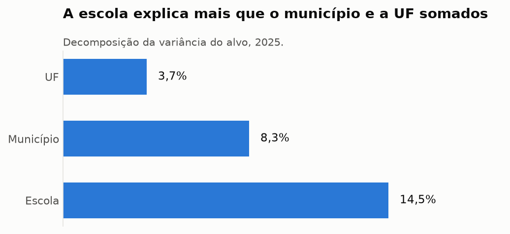
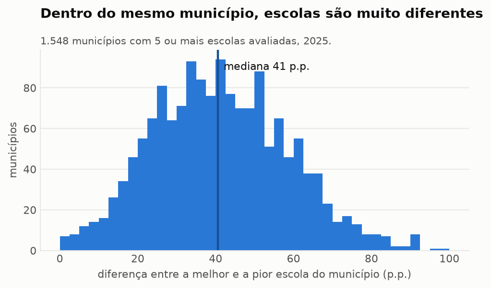
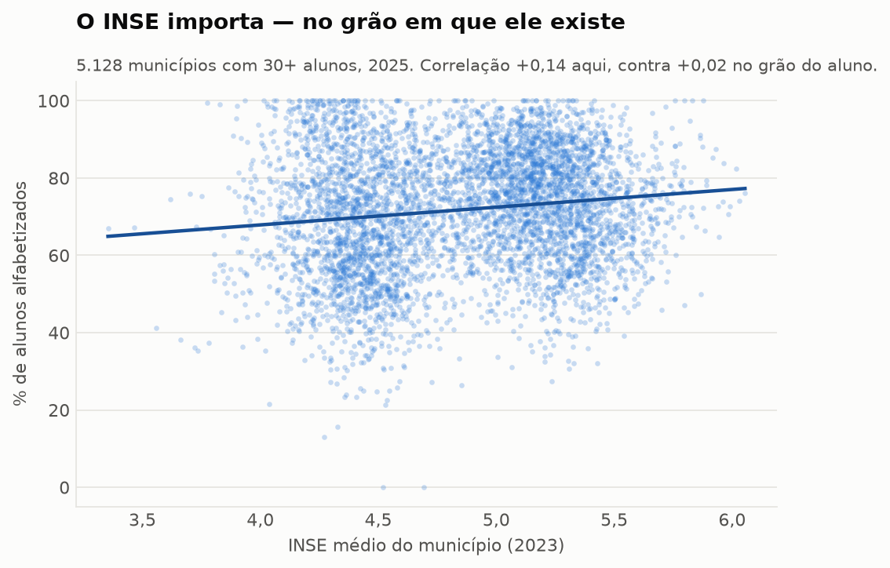
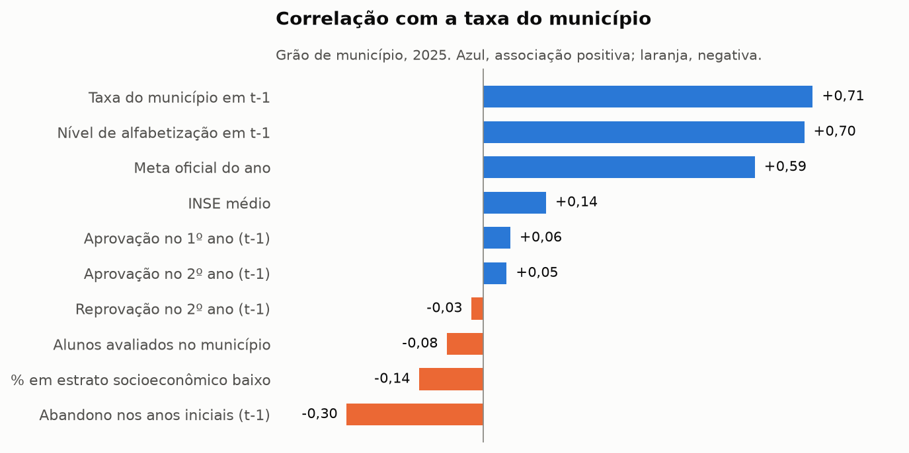
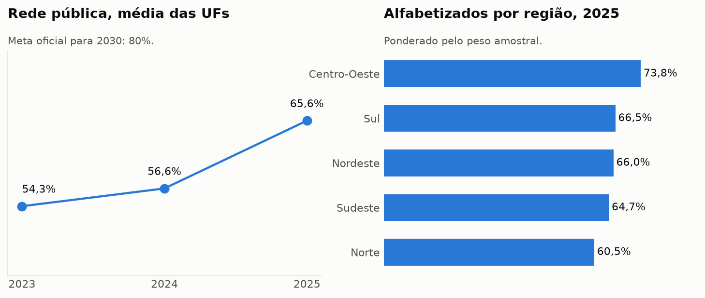

# Análise exploratória — alfabetização no grão do aluno

Base: `aluno_features`, 3.817.947 alunos avaliados em 2024 e 2025.
Gerado por `notebooks/01_analise_exploratoria.py`.

## Achados

1. O alvo é razoavelmente equilibrado: 62,5% de alfabetizados na base inteira, sem necessidade de reamostragem.
2. O salto de 59,2% para 65,7% entre 2024 e 2025 é **real**, não efeito de composição: com o conjunto de UFs fixo em 26, a diferença se mantém em +6,5 p.p.
3. **A escola é o nível territorial mais informativo**: explica 14,5% da variância do alvo, contra 8,3% do município e 3,7% da UF. E é exatamente o nível que não podemos enriquecer — o código de escola do INEP é mascarado e resorteado a cada ano. Este é o estimador simples, que superestima cerca de 1 p.p. por incluir o ruído amostral das escolas pequenas; o componente de variância da ANOVA põe a escola em 13,5%, o município em 8,1% e a UF em 4,0% (ver `reports/AUDITORIA.md`).
4. Mesmo assim, **86% da variação está entre alunos da mesma escola**, e sobre isso não há nenhuma variável na fonte: os microdados não trazem sexo, idade, raça nem dados do domicílio. Esse é o teto do modelo, e ele vem da fonte, não da modelagem.
5. No município mediano, a melhor e a pior escola diferem **41 pontos percentuais**. Tratar o município como unidade homogênea apaga essa diferença.
6. **O INSE parece irrelevante e não é.** No grão do aluno a correlação é +0,02; no grão do município sobe para +0,14, e dentro da mesma UF fica em +0,16. A diluição é consequência direta da decomposição acima: uma variável constante dentro do município não consegue explicar a variação que acontece dentro dele.
7. No grão certo as features funcionam: a taxa do ano anterior correlaciona +0,71 e o abandono nos anos iniciais -0,30. **Persistência territorial é o sinal dominante** — o melhor preditor de onde um município estará é onde ele estava.
8. A reprovação no 2º ano é inútil como feature: a aprovação média no município é 98,3% e a correlação com o alvo é -0,03. Progressão continuada faz a variável quase não variar.
9. A desigualdade regional não segue o eixo econômico esperado: o Sudeste (64,7%) fica **abaixo** do Nordeste (66,0%), e o Centro-Oeste lidera com 73,8%.

## Hipóteses para a modelagem

**H1 — Persistência territorial domina.** A taxa do município em t-1 é o preditor mais forte disponível (+0,71 no grão municipal). Um modelo que só reproduza a taxa anterior já é um baseline difícil de superar — e é contra ele, não contra a moeda, que o modelo precisa ser comparado.

**H2 — O teto do modelo é estrutural, não metodológico.** Com 86% da variância entre alunos da mesma escola e nenhuma variável de aluno na fonte, nenhum algoritmo alcança discriminação alta. Métrica alta seria indício de vazamento, não de qualidade.

**H3 — O sinal socioeconômico existe mas está no grão errado.** O INSE correlaciona +0,14 no município e +0,02 no aluno. Se houvesse INSE por escola, a contribuição seria substancialmente maior — hipótese não testável com a fonte atual, por causa do código mascarado.

**H4 — Fluxo escolar prediz alfabetização.** Abandono nos anos iniciais em t-1 correlaciona -0,30, enquanto reprovação no 2º ano não diz nada. A hipótese é que abandono capta fragilidade da rede, e reprovação apenas reflete política de progressão continuada.

**H5 — A validação precisa ser temporal e agrupada por escola.** Treinar em 2024 e testar em 2025 mede generalização de verdade. Dentro do treino, GroupKFold por escola evita que colegas do mesmo aluno fiquem dos dois lados da divisão e inflem a métrica.

## Figuras

*Variância do alvo por nível territorial*

*Amplitude entre escolas do mesmo município*

*INSE municipal versus taxa de alfabetização*

*Correlação das features no grão do município*

*Trajetória da rede pública e recorte regional*
