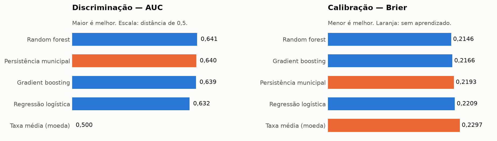
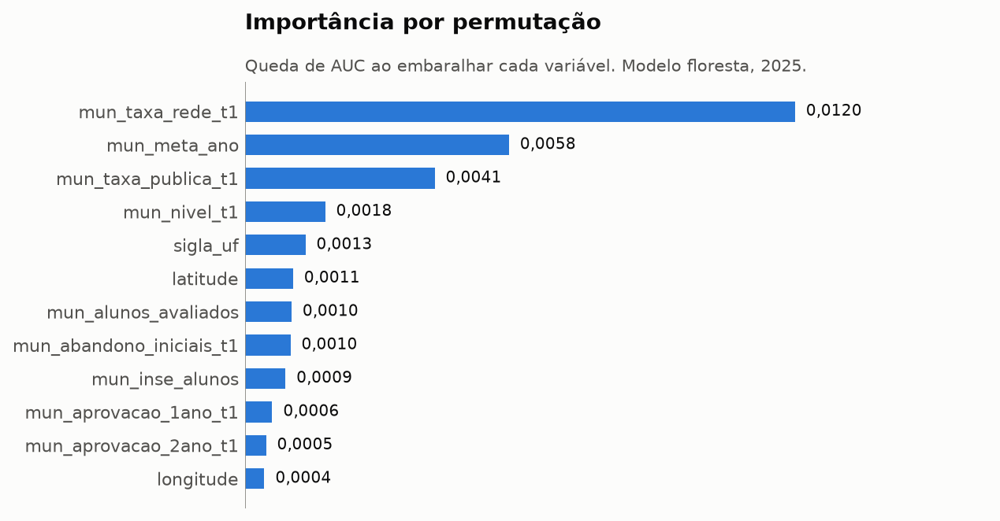

# Modelagem — predição de alfabetização no grão do aluno

Treino em 2024 (1,851,852 alunos, 42,328 escolas), teste em 2025 (1,966,095 alunos). Divisão temporal, validação cruzada agrupada por escola, tudo ponderado pelo peso amostral.

## Resultados

| modelo | auc_roc | precisao_media | brier | log_loss | taxa_base |
|---|---:|---:|---:|---:|---:|
| floresta | 0,6407 | 0,7727 | 0,2146 | 0,6170 | 0,6565 |
| persistencia_municipal | 0,6397 | 0,7724 | 0,2193 | 0,6282 | 0,6565 |
| boosting | 0,6394 | 0,7709 | 0,2166 | 0,6211 | 0,6565 |
| logistica | 0,6322 | 0,7631 | 0,2209 | 0,6319 | 0,6565 |
| taxa_base | 0,5000 | 0,6565 | 0,2297 | 0,6521 | 0,6565 |

### Validação cruzada dentro do treino

| modelo | AUC média | desvio entre folds |
|---|---:|---:|
| logistica | 0.6620 | 0.0013 |
| floresta | 0.6670 | 0.0011 |
| boosting | 0.6688 | 0.0013 |

### Ganho sobre a persistência territorial

O baseline que importa não é a moeda: é prever, para cada aluno, a taxa do seu município no ano anterior. Ele não usa aprendizado nenhum.

- **taxa_base**: -100.0% de discriminação sobre a persistência
- **logistica**: -5.4% de discriminação sobre a persistência
- **floresta**: +0.7% de discriminação sobre a persistência
- **boosting**: -0.2% de discriminação sobre a persistência

## Interpretabilidade

### Importância por permutação (queda de AUC ao embaralhar)

| feature | queda_de_auc |
|---|---:|
| mun_taxa_rede_t1 | 0,0120 |
| mun_meta_ano | 0,0058 |
| mun_taxa_publica_t1 | 0,0041 |
| mun_nivel_t1 | 0,0018 |
| sigla_uf | 0,0013 |
| latitude | 0,0010 |
| mun_alunos_avaliados | 0,0010 |
| mun_abandono_iniciais_t1 | 0,0010 |
| mun_inse_alunos | 0,0009 |
| mun_aprovacao_1ano_t1 | 0,0006 |
| mun_aprovacao_2ano_t1 | 0,0005 |
| longitude | 0,0004 |

### SHAP (magnitude média)

| feature | shap_medio |
|---|---:|
| numericas__mun_taxa_rede_t1 | 0,0282 |
| numericas__mun_taxa_publica_t1 | 0,0178 |
| numericas__mun_meta_ano | 0,0163 |
| numericas__mun_nivel_t1 | 0,0122 |
| numericas__uf_taxa_publica_t1 | 0,0100 |
| numericas__uf_meta_ano | 0,0081 |
| numericas__mun_aprovacao_1ano_t1 | 0,0076 |
| categoricas__sigla_uf_MG | 0,0072 |
| numericas__mun_abandono_iniciais_t1 | 0,0066 |
| categoricas__regiao_Sudeste | 0,0059 |
| categoricas__sigla_uf_RS | 0,0059 |
| numericas__latitude | 0,0056 |

**Features descartadas:** `mun_variacao_publica_t1`, `uf_variacao_publica_t1` — inteiramente nulas em 2024, porque a variação em t-1 exige t-2. Sob divisão temporal elas estariam presentes só no teste, e o modelo nunca teria visto um valor delas.
## Figuras

