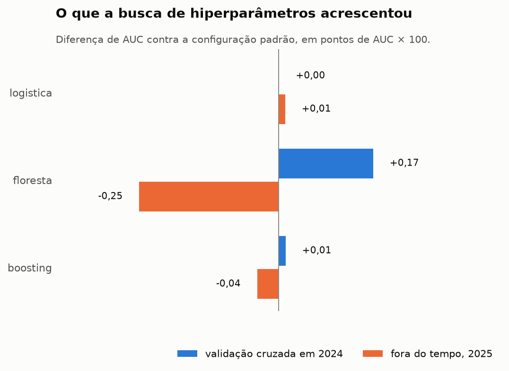

# Otimização de hiperparâmetros

Busca aleatória de **15 configurações por modelo**, validada com `GroupKFold` de 3 folds agrupados por escola, **inteiramente dentro de 2024**. O ano de 2025 entra uma única vez, depois da escolha, para medir se o ganho sobrevive fora do tempo.

Treino: 1.851.852 alunos em 42.328 escolas.

## Por que a busca não pode ver o teste

Escolher configuração olhando o desempenho em 2025 transformaria o conjunto fora do tempo em treino disfarçado: o AUC publicado passaria a medir quantas tentativas fizemos, não quanto o modelo generaliza. O agrupamento por escola é a segunda proteção — sem ele, colegas do mesmo aluno caem dos dois lados do fold e a busca escolheria a configuração que melhor decora turma, já que 14,5% da variância do alvo está entre escolas.

## Resultado por modelo

| modelo | AUC padrão (CV) | AUC melhor (CV) | ganho | fora do tempo | adotada |
|---|---:|---:|---:|---:|---|
| boosting | 0,6688 | 0,6689 ± 0,0013 | +0,013 | 0,6394 → 0,6391 | padrão |
| floresta | 0,6670 | 0,6687 ± 0,0013 | +0,171 | 0,6407 → **0,6381** | padrão |
| logistica | 0,6620 | 0,6620 ± 0,0013 | +0,001 | 0,6322 → 0,6323 | padrão |

*Ganho em pontos de AUC × 100. Nenhuma configuração ajustada foi adotada — a
seção seguinte explica por quê, e por que o critério precisou ser apertado
depois desta execução.*

## O resultado: o ajuste de hiperparâmetros não move este problema

**Nenhum dos três modelos melhorou de forma sustentável.** O boosting ganhou
0,0001 de AUC na validação cruzada, a logística 0,0000 e a floresta 0,0017 — e a
floresta, a única com ganho aparente, **ficou pior fora do tempo**: 0,6407 com a
configuração padrão contra 0,6381 com a ajustada.

Isso não é fracasso da busca: é a resposta. Varrer 42 configurações sobre 1,85
milhão de alunos, com três algoritmos de mecanismos diferentes, e não mover o
terceiro decimal do AUC é a evidência mais direta possível de que **o teto é dos
dados, não do método**. O projeto já argumentava isso pela convergência dos três
modelos na faixa 0,632–0,641; agora há a medição.

### O critério de adoção estava permissivo, e a floresta mostrou

O critério original adotava a configuração ajustada se ela ganhasse mais que **um**
desvio entre os folds. A floresta passou nesse teste por pouco — +0,0017 contra
desvio de 0,0013 — e foi adotada. A avaliação fora do tempo, feita depois e uma
única vez, mostrou que a adoção estava errada: a configuração "melhor" perdeu
0,0026 de AUC em 2025.

O critério passou a exigir **dois desvios** (`DESVIOS_PARA_ADOTAR = 2.0`). Com
ele, nenhuma das três configurações é adotada, que é a leitura correta dos dados.

Vale ser explícito sobre a ordem dos fatos, porque ela importa: **o resultado
fora do tempo foi o que revelou a permissividade do critério**. Usar o conjunto
de teste para revisar uma regra de seleção o contamina em alguma medida. Preferi
registrar isso a esconder — e a mudança é defensável sem o teste, porque um ganho
de 1,3 desvio em três folds nunca foi evidência forte, e porque a queda conhecida
de ~0,03 de AUC entre a validação cruzada e o ano seguinte torna não confiável
qualquer diferença de validação muito menor que isso.

### Por que a configuração "melhor" generaliza pior

A ajustada da floresta (`max_depth=14`, `min_samples_leaf=200`, `max_features=0.5`,
`n_estimators=300`) é mais regularizada em profundidade e folha que o padrão
(`max_depth=18`, `min_samples_leaf=100`, `max_features="sqrt"`), mas usa **metade
das variáveis em cada divisão** contra cerca de 22% do padrão. Mais variáveis por
divisão deixa as árvores mais parecidas entre si, e uma floresta de árvores
correlacionadas reduz menos variância — que é exatamente o mecanismo de que ela
depende para atravessar a mudança de regime entre 2024 e 2025.

## Configuração vencedora de cada busca

**boosting** — espaço: `learning_rate` [0.02, 0.05, 0.08, 0.15] · `max_iter` [200, 300, 500] · `max_leaf_nodes` [15, 31, 63] · `min_samples_leaf` [50, 100, 200, 400] · `l2_regularization` [0.0, 0.5, 1.0, 5.0]

Melhor: `{'min_samples_leaf': 200, 'max_leaf_nodes': 31, 'max_iter': 300, 'learning_rate': 0.08, 'l2_regularization': 0.5}` (15 candidatos, 684s)

**floresta** — espaço: `n_estimators` [150, 200, 300] · `max_depth` [10, 14, 18, 24, None] · `min_samples_leaf` [20, 50, 100, 200, 400] · `max_features` ['sqrt', 0.3, 0.5]

Melhor: `{'n_estimators': 300, 'min_samples_leaf': 200, 'max_features': 0.5, 'max_depth': 14}` (15 candidatos, 3911s)

**logistica** — espaço: `C` [0.01, 0.1, 0.3, 1.0, 3.0, 10.0] · `class_weight` [None, 'balanced']

Melhor: `{'class_weight': None, 'C': 0.01}` (12 candidatos, 192s)

## Critério de adoção

A configuração ajustada só substitui o padrão se ganhar **mais que o desvio entre os folds da própria busca**. Trocar por algo que empata dentro do ruído não é ajuste fino: é escolher barulho e perder a justificativa estrutural que o padrão tinha.

## Candidatos avaliados

### boosting

| posição | AUC médio | desvio | configuração |
|---|---:|---:|---:|
| 0 | 0,6689 | 0,0013 | `{'min_samples_leaf': 200, 'max_leaf_nodes': 31, 'max_iter': 300, 'learning_rate': 0.08, 'l2_regularization': 0.5}` |
| 1 | 0,6688 | 0,0013 | `{'min_samples_leaf': 200, 'max_leaf_nodes': 31, 'max_iter': 500, 'learning_rate': 0.05, 'l2_regularization': 5.0}` |
| 2 | 0,6688 | 0,0015 | `{'min_samples_leaf': 200, 'max_leaf_nodes': 63, 'max_iter': 300, 'learning_rate': 0.05, 'l2_regularization': 1.0}` |
| 3 | 0,6687 | 0,0013 | `{'min_samples_leaf': 100, 'max_leaf_nodes': 31, 'max_iter': 500, 'learning_rate': 0.02, 'l2_regularization': 0.0}` |
| 4 | 0,6687 | 0,0013 | `{'min_samples_leaf': 200, 'max_leaf_nodes': 63, 'max_iter': 200, 'learning_rate': 0.08, 'l2_regularization': 0.0}` |
| 5 | 0,6685 | 0,0012 | `{'min_samples_leaf': 200, 'max_leaf_nodes': 31, 'max_iter': 200, 'learning_rate': 0.15, 'l2_regularization': 1.0}` |
| 6 | 0,6684 | 0,0013 | `{'min_samples_leaf': 400, 'max_leaf_nodes': 31, 'max_iter': 200, 'learning_rate': 0.15, 'l2_regularization': 0.5}` |
| 7 | 0,6683 | 0,0012 | `{'min_samples_leaf': 200, 'max_leaf_nodes': 31, 'max_iter': 500, 'learning_rate': 0.08, 'l2_regularization': 5.0}` |
| 8 | 0,6680 | 0,0013 | `{'min_samples_leaf': 50, 'max_leaf_nodes': 63, 'max_iter': 500, 'learning_rate': 0.05, 'l2_regularization': 1.0}` |
| 9 | 0,6680 | 0,0010 | `{'min_samples_leaf': 50, 'max_leaf_nodes': 31, 'max_iter': 200, 'learning_rate': 0.15, 'l2_regularization': 1.0}` |

### floresta

| posição | AUC médio | desvio | configuração |
|---|---:|---:|---:|
| 0 | 0,6687 | 0,0013 | `{'n_estimators': 300, 'min_samples_leaf': 200, 'max_features': 0.5, 'max_depth': 14}` |
| 1 | 0,6687 | 0,0012 | `{'n_estimators': 300, 'min_samples_leaf': 100, 'max_features': 0.3, 'max_depth': 14}` |
| 2 | 0,6684 | 0,0014 | `{'n_estimators': 200, 'min_samples_leaf': 200, 'max_features': 0.3, 'max_depth': 10}` |
| 3 | 0,6684 | 0,0013 | `{'n_estimators': 150, 'min_samples_leaf': 20, 'max_features': 0.3, 'max_depth': 10}` |
| 4 | 0,6682 | 0,0015 | `{'n_estimators': 200, 'min_samples_leaf': 400, 'max_features': 'sqrt', 'max_depth': 24}` |
| 5 | 0,6682 | 0,0013 | `{'n_estimators': 150, 'min_samples_leaf': 20, 'max_features': 0.5, 'max_depth': 10}` |
| 6 | 0,6681 | 0,0014 | `{'n_estimators': 150, 'min_samples_leaf': 400, 'max_features': 0.3, 'max_depth': None}` |
| 7 | 0,6679 | 0,0015 | `{'n_estimators': 150, 'min_samples_leaf': 200, 'max_features': 'sqrt', 'max_depth': 10}` |
| 8 | 0,6678 | 0,0013 | `{'n_estimators': 200, 'min_samples_leaf': 400, 'max_features': 0.5, 'max_depth': 24}` |
| 9 | 0,6661 | 0,0012 | `{'n_estimators': 200, 'min_samples_leaf': 200, 'max_features': 0.5, 'max_depth': 24}` |

### logistica

| posição | AUC médio | desvio | configuração |
|---|---:|---:|---:|
| 0 | 0,6620 | 0,0013 | `{'class_weight': None, 'C': 0.01}` |
| 1 | 0,6620 | 0,0013 | `{'class_weight': 'balanced', 'C': 0.01}` |
| 2 | 0,6620 | 0,0013 | `{'class_weight': 'balanced', 'C': 10.0}` |
| 3 | 0,6620 | 0,0013 | `{'class_weight': None, 'C': 1.0}` |
| 4 | 0,6620 | 0,0013 | `{'class_weight': None, 'C': 0.1}` |
| 5 | 0,6620 | 0,0013 | `{'class_weight': None, 'C': 3.0}` |
| 6 | 0,6620 | 0,0013 | `{'class_weight': None, 'C': 0.3}` |
| 7 | 0,6620 | 0,0013 | `{'class_weight': None, 'C': 10.0}` |
| 8 | 0,6620 | 0,0013 | `{'class_weight': 'balanced', 'C': 3.0}` |
| 9 | 0,6620 | 0,0013 | `{'class_weight': 'balanced', 'C': 0.3}` |

## Avaliação fora do tempo

| modelo | auc_roc | precisao_media | brier | log_loss | taxa_base |
|---|---:|---:|---:|---:|---:|
| floresta_padrao | 0,6407 | 0,7727 | 0,2146 | 0,6170 | 0,6565 |
| boosting_padrao | 0,6394 | 0,7709 | 0,2166 | 0,6211 | 0,6565 |
| boosting_ajustado | 0,6391 | 0,7705 | 0,2167 | 0,6215 | 0,6565 |
| floresta_ajustado | 0,6381 | 0,7699 | 0,2150 | 0,6180 | 0,6565 |
| logistica_ajustado | 0,6323 | 0,7633 | 0,2207 | 0,6315 | 0,6565 |
| logistica_padrao | 0,6322 | 0,7631 | 0,2209 | 0,6319 | 0,6565 |

## Figura

---

## Adendo — remover features e reduzir a profundidade

Duas perguntas feitas depois da entrega, medidas na base completa (treino em
2024, avaliação única em 2025, floresta com os demais parâmetros padrão).

### Profundidade: 18 não compra nada, e 12 é o mesmo modelo com um terço do tamanho

| max_depth | AUC 2025 | Brier | ajuste | predição | tamanho | nós por árvore |
|---:|---:|---:|---:|---:|---:|---:|
| 6 | 0,6415 | 0,2151 | 34 s | 2,5 s | 9 MB | 118 |
| 8 | 0,6406 | 0,2148 | 40 s | 2,5 s | 14 MB | 398 |
| 10 | 0,6408 | 0,2147 | 44 s | 2,6 s | 25 MB | 1.077 |
| 12 | 0,6411 | 0,2146 | 48 s | 2,5 s | 45 MB | 2.318 |
| 14 | 0,6409 | 0,2146 | 50 s | 2,7 s | 73 MB | 4.077 |
| **18 (padrão)** | 0,6407 | 0,2146 | 53 s | 2,9 s | 134 MB | 7.920 |
| 24 | 0,6412 | 0,2146 | 58 s | 3,1 s | 187 MB | 11.199 |
| sem limite | 0,6407 | 0,2145 | 57 s | 3,0 s | 201 MB | 12.084 |

A qualidade é a mesma de 6 a sem limite — a diferença de AUC entre qualquer
par de linhas está dentro do ruído entre folds (0,0013). O que muda é o
tamanho: profundidade 12 entrega o mesmo AUC e o mesmo Brier com um terço do
modelo; profundidade 6, com 118 nós por árvore, ainda empata em AUC e perde
0,0005 de Brier. O tempo de ajuste quase não cai (34 s contra 53 s) porque o
custo é dominado pelo volume de dados, não pela profundidade. **Para um
serviço em produção, 10 a 12 é a escolha certa**; a busca de hiperparâmetros
já tinha visto isso (profundidade 10 com folha 200 ou 400 empatou com o
melhor candidato), mas sem medir tamanho e tempo.

O padrão do repositório continua em 18 para que todos os números publicados
descrevam um único modelo; trocar é uma linha em `src/modeling/pipeline.py`.

### Remover features não melhora, e a lista de "irrelevantes" nem é estável

A primeira tentativa deu ganho: medindo importância por permutação **em 2025**
e ficando com as 11 mais importantes, o AUC numa amostra de 300 mil alunos
subiu de 0,6380 para 0,6404. Esse ganho era vício de seleção — escolher
features olhando o conjunto de teste e depois avaliar nele. Refeito da forma
correta, com a importância medida num fold de escolas **dentro de 2024** e
uma única avaliação em 2025, na base completa:

| conjunto | features | AUC (depth 18) | AUC (depth 12) | Brier (18) |
|---|---:|---:|---:|---:|
| **todas** | 21 | **0,6407** | **0,6411** | **0,2146** |
| 14 mais importantes | 14 | 0,6374 | 0,6371 | 0,2150 |
| 11 mais importantes | 11 | 0,6376 | 0,6381 | 0,2151 |
| 8 mais importantes | 8 | 0,6375 | 0,6392 | 0,2158 |
| importância positiva no fold | 10 | 0,6375 | 0,6373 | 0,2149 |

Todo subconjunto perde para o conjunto completo, em AUC e em Brier. E o
ranking de importância medido dentro de 2024 é diferente do medido em 2025:
`escola_alunos_avaliados` é a segunda mais importante em 2024 e tem
importância negativa em 2025; `mun_nivel_t1` e as taxas de rendimento são
negativas em 2024 e positivas em 2025. Com 8 pares de features correlacionadas
acima de 0,80 (`AUDITORIA.md`, achado 5.1), a importância individual de cada
uma é instável por construção, e não há um conjunto "irrelevante" que se possa
identificar com segurança. Isso converge com a poda por redundância da
auditoria, que também piorou.

PCA ou outra projeção linear não foi testada de propósito: os modelos são de
árvore, quatro das features são categóricas, e a interpretabilidade por
variável é parte do que o projeto entrega. Se remover features não ajuda,
misturá-las em componentes tampouco ajudaria, e custaria a leitura.
