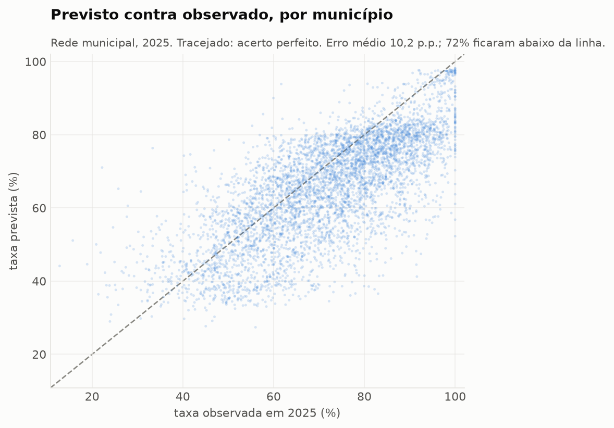
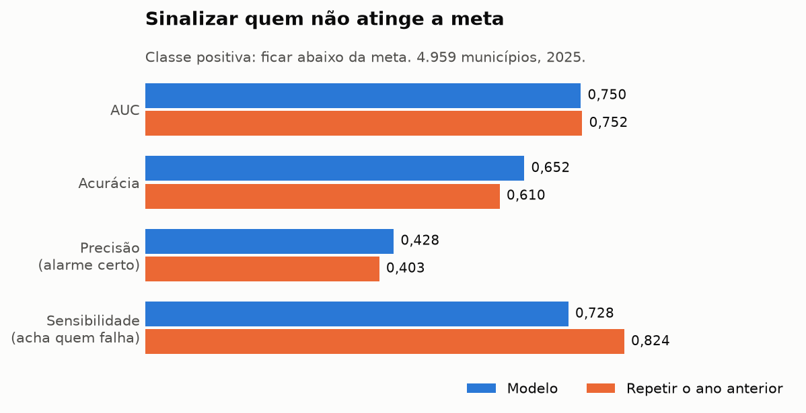
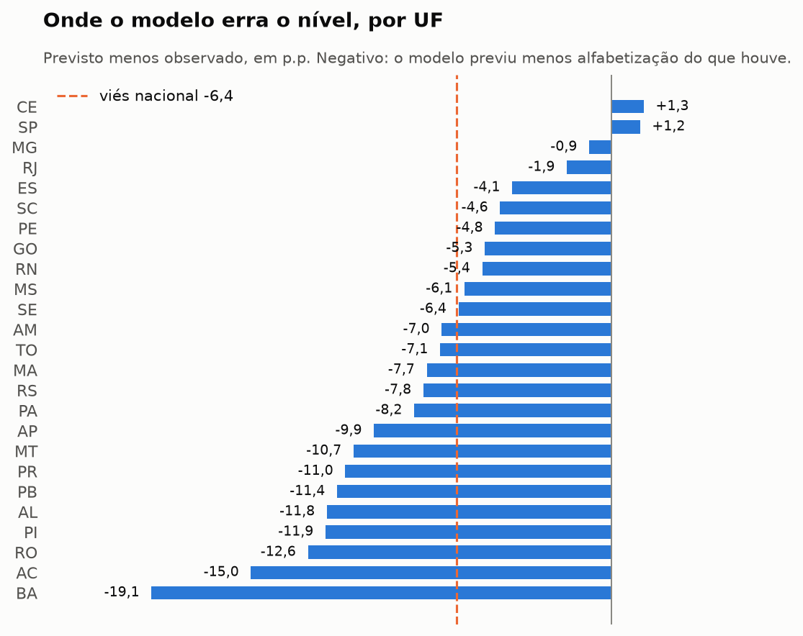

# Risco municipal — quem não atinge a meta de alfabetização

Duas partes, com modelos diferentes de propósito: a **Parte 1 afere** o método contra 2025, que o modelo não viu, e a **Parte 2 projeta** 2026 com um modelo reajustado em todos os anos disponíveis. A primeira dá a margem de erro; a segunda usa essa margem.

# Parte 1 — aferição do método (2024 → 2025)

Modelo `floresta` treinado em 2024 e projetado em 2025, agregando a probabilidade de cada aluno para o grão **município × rede municipal** — o único em que o INEP publica meta por município. Nenhuma informação de 2025 entra na predição: as features são contexto de t-1 e metas publicadas antes da avaliação.

## Dois caminhos até a taxa do município

No grão do aluno o modelo tem AUC 0,64 — modesto, porque 86% da variância do alvo está entre alunos da mesma escola e nenhuma variável disponível chega lá. Agregado ao município, o erro individual se cancela na média ponderada e o mesmo modelo chega a **AUC 0,750** para separar quem cumpre de quem não cumpre a meta. O modelo não ficou melhor: a pergunta mudou para o grão em que ele tem o que dizer.

O outro caminho é treinar direto nesse grão, com uma linha por município. Não é só mudança de escala: o modelo de aluno minimiza erro por criança, e assim o ajuste é dominado pelos municípios grandes, que concentram alunos; o modelo municipal minimiza erro por território, com cada município pesando o mesmo, que é como o resultado é medido. Ele chega a **AUC 0,758** e é o que gera o ranking e a projeção desta página. As seções seguintes comparam os dois contra a taxa do ano anterior, que é o que já se sabia sem modelo nenhum.

## Prova da agregação

A taxa observada reconstruída a partir dos microdados ponderados bate com o indicador publicado em `meta_vs_resultado_municipio`: **5.494 de 5.500 municípios (99,89%)** dentro de 0,1 p.p., com diferença mediana de 0,0025 p.p. — o arredondamento da própria publicação. Sem essa prova o resto do relatório não teria valor.

As 6 maiores divergências ficam registradas em vez de escondidas:

| id_municipio | sigla_uf | alunos_avaliados | taxa_observada | taxa_publicada | diferenca |
|---|---:|---:|---:|---:|---:|
| 1100338 | RO | 423 | 0,7413 | 0,7250 | 0,0163 |
| 1100304 | RO | 1177 | 0,7713 | 0,7847 | 0,0134 |
| 1709500 | TO | 840 | 0,6357 | 0,6426 | 0,0069 |
| 2607208 | PE | 1284 | 0,5930 | 0,5966 | 0,0036 |
| 2611101 | PE | 4737 | 0,7301 | 0,7281 | 0,0020 |
| 5103403 | MT | 6069 | 0,6144 | 0,6132 | 0,0012 |

## Erro da taxa municipal prevista

| fonte | erro_medio_absoluto | raiz_erro_quadratico | vies | correlacao | dentro_de_5pp |
|---|---:|---:|---:|---:|---:|
| modelo_municipal | 0,0997 | 0,1260 | -0,0627 | 0,7343 | 0,3150 |
| agregacao_do_aluno | 0,1020 | 0,1296 | -0,0644 | 0,7239 | 0,3112 |
| persistencia_t1 | 0,1240 | 0,1615 | -0,0907 | 0,7206 | 0,2783 |

O modelo municipal erra 10,0 p.p. em média contra 12,4 p.p. de repetir o ano anterior — **2,4 p.p. a menos, 20% de redução**. A agregação fica em 10,2 p.p., entre as duas. É no grão do território que o aprendizado supera a persistência com folga: no grão do aluno nenhum dos modelos supera a taxa do ano anterior lida sozinha.

Base: 4.959 municípios de 5.504 avaliados em 2025 (51 sem meta publicada, 71 sem taxa em t-1, e os demais com menos de 30 alunos avaliados — abaixo disso a própria taxa observada é ruído amostral).

## Acerto no risco de não atingir a meta

Classe positiva: **ficar abaixo da meta**, que é o caso que dispara ação. 1.383 municípios (27,9%) de fato ficaram abaixo em 2025.

| fonte | acuracia | precisao | recall | f1 | auc_roc |
|---|---:|---:|---:|---:|---:|
| modelo_municipal | 0,6548 | 0,4310 | 0,7426 | 0,5454 | 0,7581 |
| agregacao_do_aluno | 0,6523 | 0,4276 | 0,7281 | 0,5388 | 0,7496 |
| persistencia_t1 | 0,6100 | 0,4027 | 0,8243 | 0,5411 | 0,7521 |

Matriz de confusão (positivo = ficar abaixo da meta):

| fonte | verdadeiros_positivos | falsos_positivos | falsos_negativos | verdadeiros_negativos |
|---|---:|---:|---:|---:|
| modelo_municipal | 1027 | 1356 | 356 | 2220 |
| agregacao_do_aluno | 1007 | 1348 | 376 | 2228 |
| persistencia_t1 | 1140 | 1691 | 243 | 1885 |

Em AUC, o modelo municipal (0,758) passa tanto da persistência (0,752) quanto da agregação (0,750). É a primeira vez no projeto que algo supera a persistência territorial nessa métrica, e a margem é estreita: teste pareado contra a agregação dá intervalo de 95% entre +0,005 e +0,012 de AUC.

Já a comparação de acurácia e sensibilidade no limiar fixo da meta é enganosa, porque os três têm viés diferente: quem prevê mais baixo aciona mais alarmes e acerta mais dos que falham, ao custo de errar mais dos que cumprem. A persistência tem o maior recall da tabela justamente por prever baixo demais.

## Deriva entre anos — o que nenhum modelo treinado em t-1 poderia saber

A rede municipal saltou de 58,6% em 2024 para 66,0% em 2025: **+7,4 p.p. em um ano**. O modelo projetou 62,2%, ou seja +3,6 p.p. — capturou 49% da alta, provavelmente pela meta do ano, que é a única feature que olha para a frente. O resto ele não tinha como saber.

Descontado esse deslocamento, o erro médio cai de 10,0 p.p. para 8,6 p.p.: só **14% do erro é nível — o restante é ordenação**, e esse é o limite real do modelo. O desconto é diagnóstico e não predição: o viés só é conhecido depois da avaliação.

| sigla_uf | municipios | taxa_t1 | taxa_observada | vies | erro_medio_absoluto |
|---|---:|---:|---:|---:|---:|
| BA | 404 | 0,3660 | 0,6003 | -0,1776 | 0,1798 |
| AC | 22 | 0,4350 | 0,6449 | -0,1419 | 0,1473 |
| RO | 52 | 0,6718 | 0,8133 | -0,1410 | 0,1410 |
| AL | 101 | 0,5268 | 0,7002 | -0,1323 | 0,1382 |
| PR | 376 | 0,7423 | 0,8456 | -0,1126 | 0,1156 |
| PI | 204 | 0,6580 | 0,8011 | -0,1115 | 0,1301 |
| PB | 198 | 0,5916 | 0,7399 | -0,1050 | 0,1498 |
| AP | 16 | 0,4945 | 0,6217 | -0,0850 | 0,1112 |

O caso extremo é **RS**: a rede municipal caiu -19,3 p.p. entre 2023 e 2024, contra -2,7 p.p. da segunda maior queda. O modelo herda esse ano deprimido como patamar do estado e concentra o alarme ali: **131 dos 200 municípios de maior risco são de RS**.

E o alarme estava certo. Desses 131, **118 ficaram mesmo abaixo da meta** (90%). No estado inteiro, só 19,4% dos municípios cumpriram, contra 72,1% no país. O que o modelo errou foi a **magnitude**, não a direção: previu mediana de 54,6% contra 61,0% observada, o mesmo viés para baixo que aparece em todo o país.

A leitura, portanto, não é de erro do modelo: é de um estado cujas metas foram calibradas antes do choque e não foram repactuadas depois dele. A Parte 2 mostra que o problema continua em 2026.

## Incerteza por porte do município

O erro não é homocedástico: num município com poucas dezenas de alunos avaliados a taxa oscila por sorteio, numa capital ela é estável. O desvio usado na probabilidade é o do estrato de porte, não um número único.

| estrato | municipios | alunos_efetivos_medianos | desvio_do_erro | erro_medio_absoluto |
|---|---:|---:|---:|---:|
| 0 | 1240 | 47,0000 | 0,1262 | 0,1210 |
| 1 | 1240 | 91,6078 | 0,1158 | 0,1053 |
| 2 | 1239 | 179,8149 | 0,1030 | 0,0978 |
| 3 | 1240 | 498,2108 | 0,0860 | 0,0747 |

A probabilidade de descumprir é `Φ((meta − prevista) / σ_estrato)`. O σ vem dos resíduos de 2025: aplicado a um ano ainda não avaliado ele é a melhor estimativa disponível, mas provavelmente otimista, porque não embute a mudança de regime entre um ano e outro.

**770 municípios** saíram com probabilidade ≥ 80% de descumprir; destes, 60,5% de fato descumpriram.

Confrontando a probabilidade declarada com a frequência observada:

| faixa de risco | municipios | risco_medio_previsto | descumpriram_de_fato |
|---|---:|---:|---:|
| 0% a 20% | 926 | 0,1050 | 0,0480 |
| 20% a 40% | 1023 | 0,3020 | 0,1510 |
| 40% a 60% | 1213 | 0,4980 | 0,2700 |
| 60% a 80% | 1027 | 0,6950 | 0,3810 |
| 80% a 100% | 770 | 0,8950 | 0,6050 |

**A ordenação funciona, a calibração não.** A frequência de descumprimento cresce monotonicamente de uma faixa para a seguinte — o ranking separa bem. Mas o nível está deslocado em todas elas, pela mesma razão da seção anterior: a taxa prevista é baixa demais, então a probabilidade de ficar abaixo da meta é alta demais. **Use a ordem, não o valor absoluto** — ou recalibre contra esta tabela antes de usar o número para dimensionar recurso.

## Municípios de maior risco em 2025 (topo de 40)

| município | uf | alunos | taxa t-1 | meta | prevista | gap previsto | risco | observada |
|---|---:|---:|---:|---:|---:|---:|---:|---:|
| Canela | RS | 340 | 42,2% | 79,1% | 48,6% | -30,5 | 100% | 47,3% |
| Campo Bom | RS | 677 | 45,4% | 78,1% | 49,4% | -28,7 | 100% | 63,2% |
| Canguçu | RS | 318 | 51,7% | 79,8% | 53,6% | -26,2 | 100% | 59,1% |
| Lajeado | RS | 667 | 47,5% | 76,3% | 50,6% | -25,7 | 100% | 58,5% |
| Igrejinha | RS | 335 | 49,6% | 80,0% | 54,4% | -25,6 | 100% | 76,2% |
| Sapiranga | RS | 746 | 41,1% | 75,0% | 49,6% | -25,4 | 100% | 57,8% |
| Pindaí | BA | 159 | 38,3% | 73,8% | 45,2% | -28,6 | 100% | 75,7% |
| Santa Maria | RS | 1.194 | 39,7% | 70,0% | 46,2% | -23,8 | 100% | 47,9% |
| Caxias do Sul | RS | 2.796 | 43,2% | 72,6% | 49,4% | -23,2 | 100% | 52,9% |
| Gramado | RS | 400 | 55,3% | 79,3% | 56,5% | -22,9 | 100% | 71,9% |
| Novo Hamburgo | RS | 1.984 | 36,0% | 68,1% | 45,6% | -22,4 | 100% | 46,8% |
| São Gabriel | RS | 358 | 35,6% | 67,2% | 44,8% | -22,4 | 100% | 44,2% |
| São Lourenço do Sul | RS | 287 | 58,7% | 79,4% | 57,0% | -22,4 | 100% | 59,2% |
| Bento Gonçalves | RS | 746 | 50,8% | 78,2% | 55,8% | -22,3 | 100% | 69,7% |
| Venâncio Aires | RS | 294 | 59,2% | 78,7% | 56,8% | -21,9 | 99% | 70,1% |
| Gravataí | RS | 2.078 | 41,0% | 68,9% | 47,0% | -21,9 | 99% | 46,0% |
| Urbano Santos | MA | 334 | 38,6% | 77,7% | 55,9% | -21,9 | 99% | 71,2% |
| São Luiz Gonzaga | RS | 131 | 42,3% | 80,0% | 54,2% | -25,8 | 99% | 63,2% |
| Osório | RS | 287 | 44,5% | 71,7% | 50,2% | -21,5 | 99% | 46,4% |
| Viamão | RS | 2.107 | 38,9% | 65,7% | 44,3% | -21,4 | 99% | 41,0% |
| Dois Irmãos | RS | 285 | 56,9% | 78,9% | 57,5% | -21,4 | 99% | 66,9% |
| Santo Antônio do Içá | AM | 425 | 37,9% | 66,3% | 45,1% | -21,2 | 99% | 61,7% |
| Nova Hartz | RS | 230 | 45,3% | 74,5% | 49,4% | -25,1 | 99% | 46,9% |
| Santa Cruz do Sul | RS | 580 | 43,8% | 69,7% | 49,0% | -20,7 | 99% | 54,4% |
| Marau | RS | 297 | 43,6% | 70,9% | 50,6% | -20,2 | 99% | 47,1% |
| Bagé | RS | 661 | 46,6% | 67,8% | 47,7% | -20,2 | 99% | 51,2% |
| Candelária | RS | 184 | 53,2% | 76,8% | 52,6% | -24,1 | 99% | 67,3% |
| Uruguaiana | RS | 602 | 47,3% | 67,4% | 47,3% | -20,0 | 99% | 60,0% |
| Montenegro | RS | 343 | 39,8% | 70,4% | 50,4% | -20,0 | 99% | 48,6% |
| São Sepé | RS | 111 | 49,7% | 80,0% | 53,1% | -26,9 | 99% | 30,2% |
| São Marcos | RS | 103 | 38,3% | 80,0% | 53,1% | -26,9 | 99% | 61,8% |
| Esteio | RS | 712 | 47,0% | 68,7% | 48,8% | -19,9 | 99% | 53,2% |
| Farroupilha | RS | 639 | 56,7% | 80,0% | 60,1% | -19,9 | 99% | 75,7% |
| Araricá | RS | 138 | 43,5% | 77,0% | 53,3% | -23,7 | 99% | 61,7% |
| Novo Aripuanã | AM | 149 | 51,0% | 80,0% | 56,5% | -23,5 | 99% | 64,6% |
| Pantano Grande | RS | 118 | 25,7% | 74,8% | 48,5% | -26,4 | 99% | 54,9% |
| São Leopoldo | RS | 1.639 | 37,2% | 64,5% | 45,0% | -19,5 | 99% | 40,4% |
| Taquara | RS | 288 | 44,6% | 69,1% | 49,7% | -19,4 | 99% | 65,2% |
| Cachoeirinha | RS | 934 | 40,6% | 65,2% | 46,0% | -19,2 | 99% | 46,4% |
| Solânea | PB | 266 | 45,7% | 79,0% | 56,1% | -22,9 | 99% | 83,2% |

Taxas em pontos percentuais. `observada` é a conferência posterior, não entrou na predição — e mostra quantos superaram a projeção. A tabela completa fica em `data/predictions/risco_2025_aferido.parquet`.

## Figuras

Features descartadas por serem nulas em 2024: `mun_variacao_publica_t1`, `uf_variacao_publica_t1`.

---

# Parte 2 — projeção de 2026

Tudo acima é **aferição**: mede o método contra um ano com gabarito. Esta parte é **previsão**, e não tem contra o que conferir até o INEP divulgar 2026.

**A taxa projetada sai do modelo municipal**, que venceu a comparação da Parte 1, reajustado com os quadros de 2024 e 2025. A agregação da predição do aluno também foi reajustada, com **3.817.947 alunos dos dois anos**, e continua na saída para comparação. A divisão temporal existe para medir generalização, não para limitar o que o modelo final aprende — descartar metade dos dados na hora de projetar não melhoraria previsão nenhuma.

## Como os quadros de features foram montados

O quadro municipal é direto: uma linha por município, com os indicadores de 2025 como contexto de t-1, as metas de 2026 e as taxas de rendimento de 2025. Nada aí depende de saber quem será avaliado.

O quadro de alunos exige um contorno, porque não existe roteiro de alunos de 2026 — a avaliação não ocorreu. Como **nenhuma feature descreve a criança**, cada aluno avaliado em 2025 vira uma linha de 2026 com o mesmo território, escola e peso, e todo o contexto trocado. **A suposição embutida é de composição**: a coorte de 2026 se parece com a de 2025 em porte de escola e distribuição de pesos. Município que fechar escolas, crescer muito ou migrar de rede vai destoar por um motivo que não é do modelo. Há verificação automática de que o contexto foi de fato reescrito — um merge que falhasse em silêncio repetiria o ano anterior sem mudar o formato da saída.

É também dessa agregação que vem o tamanho amostral efetivo de cada município, usado para estratificar a incerteza da probabilidade.

## Resultado

**1.207 de 4.972 municípios (24,3%) são projetados abaixo da meta de 2026.** A meta mediana do ano é 69,4% e a taxa mediana projetada é 75,0%.

**Leia esse número com o viés da Parte 1 em mente.** O modelo subestimou 2025 em 6,3 p.p., e nada garante que não subestime 2026 também — treinar com 2025 junto corrige parte disso, mas ancora a previsão entre os dois regimes. Se a alta continuar, o número acima é um teto pessimista: a contagem real de municípios em risco tende a ser menor.

## Onde o risco se concentra

| sigla_uf | municipios | projetados_abaixo | proporcao | taxa_t1_mediana | meta_mediana |
|---|---:|---:|---:|---:|---:|
| RS | 299 | 283 | 0,9465 | 0,6232 | 0,7590 |
| SC | 256 | 187 | 0,7305 | 0,7218 | 0,7293 |
| AM | 60 | 32 | 0,5333 | 0,5652 | 0,6172 |
| SP | 577 | 285 | 0,4939 | 0,6599 | 0,6882 |
| RN | 140 | 49 | 0,3500 | 0,5069 | 0,5644 |
| PA | 143 | 45 | 0,3147 | 0,5948 | 0,6268 |
| RJ | 92 | 26 | 0,2826 | 0,6446 | 0,6774 |
| CE | 184 | 33 | 0,1793 | 0,9342 | 0,8000 |

**RS responde por 283 dos 1.207 municípios em risco** — 94,6% dos seus. Isso já aparecia na Parte 1, mas por um motivo diferente, e vale separar os dois.

Lá, o modelo herdava o ano deprimido de 2024 como se fosse estrutura. Aqui ele já viu a recuperação: a rede municipal de RS foi a 63,5% em 2023 → 44,2% em 2024 → 52,1% em 2025. O problema é outro — **a meta não foi repactuada depois do choque**. A meta mediana de RS para 2026 é 75,9%, acima da mediana nacional de 69,4%, porque a trajetória foi calibrada sobre o patamar de 2023 — que o estado ainda não recuperou. Cumprir exigiria **+13,6 p.p. em um ano**, contra um avanço mediano nacional de +7,8 p.p. entre 2024 e 2025.

Não é previsão de má gestão: é meta incompatível com a trajetória. É exatamente o tipo de caso que justifica repactuação, e o tipo de conclusão que um ranking sem leitura de contexto transformaria numa lista de culpados.

## Municípios de maior risco em 2026 (topo de 40)

| município | uf | alunos | taxa t-1 | meta | prevista | gap previsto | risco |
|---|---:|---:|---:|---:|---:|---:|---:|
| Viamão | RS | 2.107 | 41,0% | 69,0% | 46,1% | -22,9 | 100% |
| São Gabriel | RS | 358 | 44,2% | 70,1% | 47,2% | -22,9 | 100% |
| Osório | RS | 287 | 46,4% | 73,5% | 50,7% | -22,8 | 100% |
| Gravataí | RS | 2.078 | 46,0% | 71,4% | 49,1% | -22,3 | 100% |
| Rio Grande | RS | 1.138 | 35,7% | 66,6% | 44,7% | -21,9 | 99% |
| Canoas | RS | 2.010 | 41,9% | 66,1% | 44,4% | -21,7 | 99% |
| Tramandaí | RS | 548 | 42,5% | 66,7% | 45,1% | -21,6 | 99% |
| São Leopoldo | RS | 1.639 | 40,4% | 68,0% | 46,6% | -21,5 | 99% |
| Passo Fundo | RS | 1.169 | 39,3% | 68,8% | 47,5% | -21,3 | 99% |
| Triunfo | RS | 296 | 48,6% | 73,0% | 52,2% | -20,8 | 99% |
| São Lourenço do Sul | RS | 287 | 59,2% | 79,5% | 58,7% | -20,8 | 99% |
| Canguçu | RS | 318 | 59,1% | 79,8% | 59,8% | -20,0 | 99% |
| Balneário Pinhal | RS | 174 | 31,9% | 68,7% | 44,8% | -23,9 | 99% |
| Canela | RS | 340 | 47,3% | 79,3% | 59,3% | -19,9 | 99% |
| Cachoeirinha | RS | 934 | 46,4% | 68,6% | 48,7% | -19,9 | 99% |
| Alvorada | RS | 1.568 | 40,5% | 62,6% | 42,9% | -19,8 | 99% |
| Guaíba | RS | 832 | 41,2% | 64,3% | 44,6% | -19,7 | 99% |
| Bagé | RS | 661 | 51,2% | 70,6% | 52,1% | -18,5 | 98% |
| São Sepé | RS | 111 | 30,2% | 80,0% | 55,2% | -24,8 | 98% |
| Imbé | RS | 272 | 45,5% | 72,6% | 51,0% | -21,6 | 98% |
| Santa Maria | RS | 1.194 | 47,9% | 72,2% | 54,2% | -18,0 | 98% |
| Charqueadas | RS | 216 | 43,8% | 71,4% | 50,2% | -21,2 | 98% |
| Marau | RS | 297 | 47,1% | 72,9% | 55,7% | -17,2 | 98% |
| Novo Hamburgo | RS | 1.984 | 46,8% | 70,7% | 53,6% | -17,1 | 98% |
| São Gonçalo do Amarante | RN | 694 | 37,4% | 65,6% | 48,6% | -17,0 | 98% |
| Montenegro | RS | 343 | 48,6% | 72,5% | 55,7% | -16,8 | 97% |
| Sapiranga | RS | 746 | 57,8% | 76,1% | 59,4% | -16,6 | 97% |
| Porto Alegre | RS | 2.677 | 26,7% | 59,0% | 42,4% | -16,6 | 97% |
| São José do Norte | RS | 193 | 35,5% | 66,5% | 46,7% | -19,7 | 97% |
| São Jerônimo | RS | 44 | 48,9% | 80,0% | 56,1% | -23,9 | 97% |
| Encruzilhada do Sul | RS | 125 | 49,0% | 71,5% | 49,7% | -21,8 | 97% |
| Cidreira | RS | 145 | 29,9% | 60,6% | 41,2% | -19,3 | 97% |
| Capão do Leão | RS | 265 | 32,6% | 63,7% | 44,6% | -19,2 | 97% |
| São Borja | RS | 368 | 45,5% | 72,3% | 56,3% | -16,0 | 97% |
| Sapucaia do Sul | RS | 1.080 | 54,4% | 69,1% | 53,3% | -15,9 | 97% |
| Cachoeira do Sul | RS | 265 | 45,7% | 68,3% | 49,4% | -18,9 | 97% |
| Pantano Grande | RS | 118 | 54,9% | 75,9% | 54,8% | -21,2 | 97% |
| Santa Cruz do Sul | RS | 580 | 54,4% | 72,0% | 56,3% | -15,6 | 97% |
| Camaquã | RS | 354 | 57,1% | 68,8% | 53,2% | -15,6 | 97% |
| Esteio | RS | 712 | 53,2% | 71,3% | 55,8% | -15,5 | 96% |

Sem coluna de observado: não existe ainda. A tabela completa fica em `data/predictions/risco_2026_projetado.parquet`.
